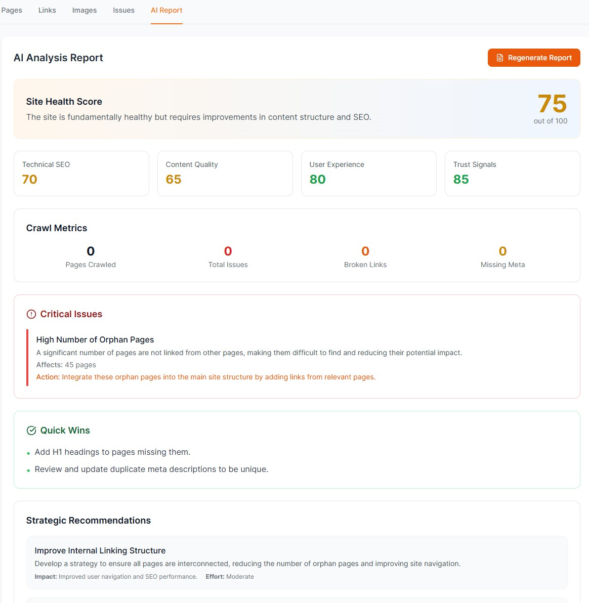
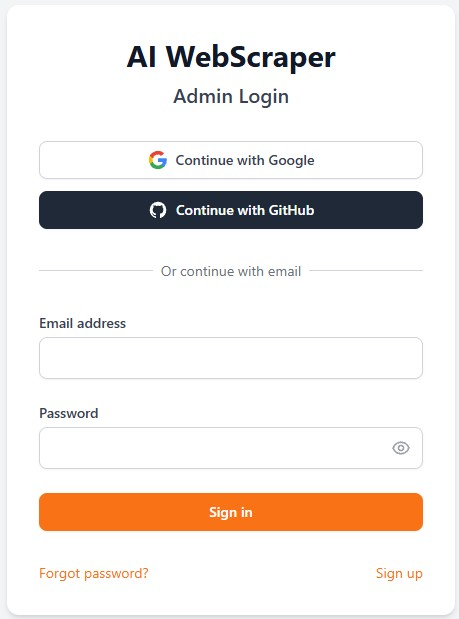

<div align="center">

# AI WebScraper

### Intelligent website crawling and SEO analysis with AI-powered insights

[](https://github.com/RCushmaniii/ai-webscraper)
[](LICENSE)
[](https://www.typescriptlang.org/)
[](https://www.python.org/)

[**Documentation**](docs/) · [**Report Bug**](https://github.com/RCushmaniii/ai-webscraper/issues) · [**API Docs**](http://localhost:8000/docs)



</div>

---

## Overview

AI WebScraper crawls websites, extracts SEO metadata, detects technical issues, and generates AI-powered analysis reports. Built for marketing teams and site owners who need actionable website insights without enterprise overhead.

### Key Results

- **1,150+ pages** crawled and analyzed in production testing
- **292+ links** extracted with automatic internal/external categorization
- **15-30 issues** detected per crawl across 9 SEO categories
- **Sub-2s page processing** with optimized batch operations

---

## Features

### Core Capabilities

| Feature | Benefit |
|---------|---------|
| **Intelligent Crawling** | Depth control, rate limiting, robots.txt compliance |
| **SEO Issue Detection** | 9 categories including missing titles, thin content, broken links |
| **AI-Powered Reports** | GPT-4 generated summaries with actionable recommendations |
| **Image Accessibility** | Automatic alt text detection for WCAG compliance |
| **Link Analysis** | Internal/external categorization with broken link detection |
| **JavaScript Rendering** | Playwright-based rendering for dynamic content |

### Technical Highlights

- **Production-ready architecture** with Celery task queue and Redis
- **Row Level Security (RLS)** on all database tables
- **Tier-based access control** with free tier limits (3 crawls for free users)
- **Real-time monitoring** with automatic stale crawl detection

<details>
<summary>Screenshots</summary>

### Login


### AI Analysis Report


</details>

---

## Prerequisites

- **Node.js** 18.17+ (check: `node -v`)
- **Python** 3.11+ (check: `python --version`)
- **Redis** server running locally or Upstash account
- **Supabase** account (free tier available)
- **OpenAI API key** for AI features

---

## Quick Start

### 1. Clone & Install

```powershell
# Clone repository
git clone https://github.com/RCushmaniii/ai-webscraper.git
cd ai-webscraper

# Install frontend dependencies
cd frontend
npm install
cd ..

# Install backend dependencies
cd backend
python -m venv venv
.\venv\Scripts\activate
pip install -r requirements.txt
cd ..
```

### 2. Environment Setup

```powershell
# Create backend environment file
notepad backend\.env
```

Required backend variables:

```bash
# backend/.env
SUPABASE_URL=https://your-project.supabase.co
SUPABASE_KEY=your_supabase_anon_key
SUPABASE_SERVICE_ROLE_KEY=your_service_role_key
OPENAI_API_KEY=sk-...
CELERY_BROKER_URL=redis://localhost:6379/0
CELERY_RESULT_BACKEND=redis://localhost:6379/0
BACKEND_CORS_ORIGINS=["http://localhost:3000"]
```

```powershell
# Create frontend environment file
notepad frontend\.env
```

Required frontend variables:

```bash
# frontend/.env
REACT_APP_API_URL=http://localhost:8000/api/v1
REACT_APP_SUPABASE_URL=https://your-project.supabase.co
REACT_APP_SUPABASE_ANON_KEY=your_supabase_anon_key
```

### 3. Database Setup

1. Create a [Supabase](https://supabase.com) project
2. Run migrations in the Supabase SQL editor:
   - `database/migrations/PRODUCTION_READY_MIGRATION.sql`
   - `database/migrations/fix_all_rls_policies.sql`

### 4. Run Development Servers

```powershell
# Option A: Use startup script (recommended)
.\start.bat

# Option B: Manual startup (3 terminals)

# Terminal 1 - Backend API
cd backend
.\venv\Scripts\activate
uvicorn app.main:app --reload --host 0.0.0.0 --port 8000

# Terminal 2 - Celery Worker
cd backend
.\venv\Scripts\activate
celery -A app.services.worker.celery_app worker --loglevel=info --pool=solo

# Terminal 3 - Frontend
cd frontend
npm start
```

Access the application:

- **Frontend**: http://localhost:3000
- **Backend API**: http://localhost:8000
- **API Documentation**: http://localhost:8000/docs

---

## Project Structure

```
ai-webscraper/
├── backend/                    # FastAPI Python backend
│   ├── app/
│   │   ├── api/routes/        # API endpoint handlers
│   │   ├── core/              # Config, auth, domain blacklist
│   │   ├── models/            # Pydantic data models
│   │   └── services/          # Crawler, worker, issue detector
│   ├── requirements.txt       # Python dependencies
│   └── .env                   # Backend environment variables
│
├── frontend/                   # React TypeScript frontend
│   ├── src/
│   │   ├── components/        # Reusable UI components
│   │   ├── contexts/          # Auth context
│   │   ├── pages/             # Route pages
│   │   └── services/          # API client
│   ├── package.json           # Node dependencies
│   └── .env                   # Frontend environment variables
│
├── database/
│   └── migrations/            # SQL migration scripts
│
├── supabase/
│   └── migrations/            # Supabase-specific migrations
│
├── docs/                      # Additional documentation
├── start.bat                  # Windows startup script
├── CLAUDE.md                  # AI assistant context guide
└── README.md                  # This file
```

---

## Configuration

### Backend Environment Variables

| Variable | Description | Required |
|----------|-------------|----------|
| `SUPABASE_URL` | Supabase project URL | Yes |
| `SUPABASE_KEY` | Supabase anon key | Yes |
| `SUPABASE_SERVICE_ROLE_KEY` | Service role key (bypasses RLS) | Yes |
| `OPENAI_API_KEY` | OpenAI API key for AI features | Yes |
| `CELERY_BROKER_URL` | Redis connection for task queue | Yes |
| `CELERY_RESULT_BACKEND` | Redis connection for results | Yes |
| `BACKEND_CORS_ORIGINS` | Allowed origins (JSON array) | Yes |
| `ENABLE_LLM_ANALYSIS` | Enable AI analysis (true/false) | No |
| `MAX_LLM_COST_PER_CRAWL` | Budget limit per crawl (USD) | No |

### Frontend Environment Variables

| Variable | Description | Required |
|----------|-------------|----------|
| `REACT_APP_API_URL` | Backend API base URL | Yes |
| `REACT_APP_SUPABASE_URL` | Supabase project URL | Yes |
| `REACT_APP_SUPABASE_ANON_KEY` | Supabase anon key | Yes |

---

## Performance

Measured on production workloads:

| Metric | Value |
|--------|-------|
| Pages per crawl | 1,150+ verified |
| Links extracted | 292+ per site |
| Images processed | 187+ with metadata |
| Issue detection | 15-30 issues per crawl |
| Crawl speed | 10-15x improvement after optimization |

---

## Security

- Row Level Security (RLS) on all database tables
- Service role separation for admin operations
- JWT-based authentication via Supabase Auth
- Rate limiting by user tier (Free: 3 crawls, Admin: unlimited)
- CORS configuration for production domains
- Domain blacklist prevents crawling social media and ad networks
- Input validation with Pydantic models

---

## User Tiers

| Feature | Free Tier | Admin |
|---------|-----------|-------|
| Crawls | 3 total | Unlimited |
| Pages per crawl | 100 | 1,000 |
| AI Reports | Yes | Yes |
| User Management | No | Yes |

Free users see their remaining crawls in the UI with an upgrade path.

---

## Testing

```powershell
# Backend tests
cd backend
pytest tests/ -v

# Frontend tests
cd frontend
npm test

# Type checking
cd frontend
npx tsc --noEmit
```

---

## Deployment

### Backend (Railway/Render)

1. Connect GitHub repository
2. Set environment variables
3. Deploy with Python 3.11+ runtime
4. Configure Redis add-on for Celery

### Frontend (Vercel)

```powershell
# Install Vercel CLI
npm i -g vercel

# Deploy
cd frontend
vercel --prod
```

Set environment variables in Vercel dashboard.

### Database (Supabase)

1. Run all migrations in production database
2. Verify RLS policies are active
3. Update CORS origins for production domains

---

## Documentation

- **[CLAUDE.md](CLAUDE.md)** - AI assistant context and conventions
- **[CHANGELOG.md](CHANGELOG.md)** - Version history
- **[docs/LLM_SERVICE.md](docs/LLM_SERVICE.md)** - AI analysis features
- **[docs/DEPLOYMENT_PLAN.md](docs/DEPLOYMENT_PLAN.md)** - Deployment guide
- **[database/README.md](database/README.md)** - Database schema

---

## Roadmap

- [x] ~~Core crawling functionality~~
- [x] ~~SEO issue detection (9 categories)~~
- [x] ~~AI-powered report generation~~
- [x] ~~User tier system with crawl limits~~
- [ ] Pro tier with payment integration
- [ ] Multi-language support
- [ ] Scheduled recurring crawls
- [ ] White-label reporting

---

## Contributing

1. Fork the repository
2. Create feature branch (`git checkout -b feature/new-feature`)
3. Commit changes (`git commit -m 'Add new feature'`)
4. Push to branch (`git push origin feature/new-feature`)
5. Open Pull Request

---

## License

This project is licensed under the MIT License - see [LICENSE](LICENSE) for details.

---

## Acknowledgments

- [FastAPI](https://fastapi.tiangolo.com/) - Python web framework
- [React](https://react.dev/) - UI library
- [Supabase](https://supabase.com/) - Backend infrastructure
- [Tailwind CSS](https://tailwindcss.com/) - Styling
- [OpenAI](https://openai.com/) - AI capabilities

---

<div align="center">

**Built by [Robert Cushman](https://github.com/RCushmaniii) | [CushLabs](https://cushlabs.ai)**

</div>
